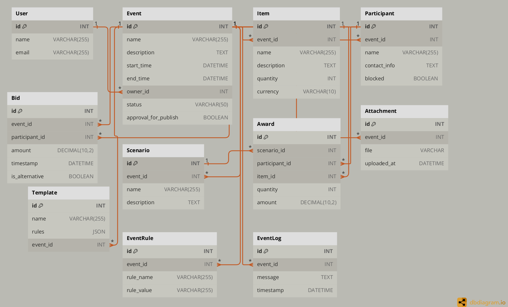

# Event Management API

  

The Event Management API is a Django-based API for managing events, participants, items, bids, awards, scenarios, attachments, templates, rules, and logs within your application.

  ### Diagram DB
  
  

### Features

-   **Events**: Create, manage, and track events with status (Draft, Published, etc.), dates, and descriptions.
-   **Participants and Items**: Manage participants with contact details and items associated with events.
-   **Bidding**: Track bids placed by participants, including amount, timestamp, and alternative status.
-   **Scenarios and Awards**: Define scenarios, issue awards to participants with linked items and quantities.
-   **Attachments**: Upload and manage event-related files with timestamps.
-   **Templates and Rules**: Utilize templates with customizable rules stored as JSON.
-   **Logs**: Track event-specific activities with messages and timestamps.
- **User Registration**: Register new users.
- **User Login**: Authenticate users and issue tokens.
- **Token Refresh**: Refresh expired access tokens.

### Testing with Live Endpoint

To test the API with the live endpoint, please use the following resources:

-   **Live Endpoint**: Access the live API at [event-management-api-vwio.onrender.com](https://event-management-api-m7wp.onrender.com).
    
-   **API Documentation**:
    
    -   **Swagger UI**: Interactively explore and test API endpoints at [event-management-api-vwio.onrender.com/api/schema/swagger-ui/](https://event-management-api-m7wp.onrender.com/api/schema/swagger-ui/).
    -   **Redoc**: View detailed API documentation at [event-management-api-vwio.onrender.com/api/schema/redoc/](https://event-management-api-m7wp.onrender.com/api/schema/redoc/).
-   **Quick Guide**: Before using the API, please read the [Quick Guide](./docs/QuickStart_guide.md) to get started.
## Installation

### Using Docker

  

#### Prerequisites

  

- Docker installed on your local machine. You can download Docker from [Docker Hub](https://www.docker.com/products/docker-desktop/).

  

#### Clone the repository

  
  

    git clone https://github.com/Laban254/Event-management-API.git
    
    cd Event-management-API/src

  

#### Build the Docker image

  
  

`docker build -t event-management-api .`

  

#### Run the Docker container

  

`docker run -p 8000:8000 event-management-api`

  

The API server will be accessible at `http://localhost:8000/`.

  

### Without Docker

  

#### Prerequisites

  

- Python 3.10 installed on your local machine. You can download Python from [here](https://www.python.org/downloads/).

- SQLite database is used by default with Django.

  

#### Clone the repository

  
  
  

    git clone https://github.com/Laban254/Event-management-API.git
    
    cd Event-management-API/src

  

#### Setup virtual environment (optional but recommended)

  
  
  

    python -m venv env
    
    source env/bin/activate # On Windows use `env\Scripts\activate

  

#### Install Python dependencies

  
  

`pip install -r requirements.txt`

  

#### Apply database migrations

  
  

`python manage.py migrate`

  

#### Run the Django development server

  

`python manage.py runserver`

  

The API server will be accessible at `http://localhost:8000/`.

  

### API Documentation

For detailed API documentation, including endpoints, parameters, authentication methods, error handling, and more, please refer to our comprehensive API documentation available at the following resources:

- **Quick Guide**: For a quick start and essential usage instructions, refer to the [Quick Guide](./docs/QuickStart_guide.md)  
- **Swagger UI**: An interactive API explorer that allows you to visualize and interact with the API's resources. You can try out API requests directly from the browser `http://127.0.0.1:8004/api/schema/swagger-ui/`
    
-   **ReDoc**: A static API documentation generator that provides a beautifully rendered, responsive documentation site. `http://127.0.0.1:8004/api/schema/redoc/`
  

## License

This project is licensed under the MIT License. See the LICENSE file for details.

## Contact

For any questions or inquiries, please contact:

-   **Laban254** - [GitHub](https://github.com/Laban254)
